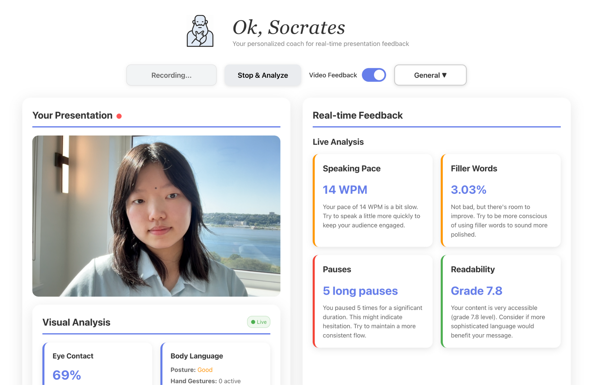

# Ok, Socrates: Your Live Presentation Coach

**Ok, Socrates** is a real-time presentation analyzer and note-taker web app. It transcribes and provides instant feedback both on verbal and visual aspects of your presentation. More specifically, it will judge on speaking pace, filler words, pauses, readability, eye contact, and posture during live presentations.

This was made for the education track at HackMIT 2025 and the Wispr Sponsor Challenge.

<p align="center">

  <em>User interface with real-time presentation analysis</em>
</p>

## Features

- **Real-time Speech-to-Text**: Uses Google Cloud Speech-to-Text API for accurate transcription
- **Live Feedback**: Get instant analysis every 5 seconds during your presentation
- **Comprehensive Metrics**:
  - Speaking pace (WPM analysis)
  - Filler word detection and percentage
  - Pause analysis
  - Readability analysis
  - Eye contact tracking and percentage
  - Posture analysis and body language
- **Visual Feedback**: Uses MediaPipe to analyze face and pose detection, and hand tracking
- **Intuitive UI**: Beautiful, intuitive UI with color-coded metrics
- **Follow-up Questions**: Uses OpenAI API for specific and thorough questions based on your presentation content
- **Final Analysis**: Complete report at the end of your presentation, including AI-generated feedback

## Quick Start

### Prerequisites

- Node.js (v16 or higher)
- Google Cloud Speech-to-Text API
- OpenAI API
- MediaPipe/face_mesh

### Installation

1. **Clone the repository**
   ```bash
   git clone <your-repo-url>
   cd HackMIT-2025
   ```

2. **Install dependencies**
   ```bash
   # Install root dependencies
   npm install

   # Install client dependencies
   cd client
   npm install socket.io-client
   npm install @mediapipe/face_mesh @mediapipe/pose @mediapipe/hands

   # Install server dependencies
   cd ../server
   npm install socket.io-server
   npm install @google-cloud/speech
   ```

3. **Set up API keys**

   **OpenAI API Key:**
   - Visit [OpenAI](https://openai.com) and get your API key
   - Create a file called `openai-key.txt` in the `server/` directory
   - Paste your API key (starts with "sk-") into this file

   **Google Cloud Speech-to-Text:**
   - Visit [Google Cloud Console](https://console.cloud.google.com)
   - Enable the Speech-to-Text API
   - Set up authentication (service account key or default credentials)

4. **Set up environment variables**

   Create a `.env` file in the root directory:
   ```env
   # Server Configuration
   PORT=4000

   # Client Configuration
   VITE_SOCKET_URL=http://localhost:4000
   ```

### Running the Application

1. **Start the server** (in one terminal)
   ```bash
   cd server
   npm run dev
   ```

2. **Start the client** (in another terminal)
   ```bash
   cd client
   npm run dev
   ```

3. **Open your browser**
   - Navigate to `http://localhost:5173`
   - Allow microphone and camera permissions when prompted
   - Enable "Video Feedback" for visual analysis
   - Click "Start Presentation" to begin!

## How to Use

1. **Start Recording**: Click the "Start Presentation" button
2. **Speak Naturally**: The app will transcribe your speech in real-time
3. **Get Live Feedback**: Every 5 seconds, you'll see updated metrics
4. **Stop & Analyze**: Click "Stop & Analyze" for a final comprehensive report
5. **Review Results**: Check your metrics and suggested follow-up questions

## Metrics Explained

### Speaking Pace
- **Good**: 110-160 WPM (words per minute)
- **Too Slow**: <110 WPM - try to speak more quickly
- **Too Fast**: >160 WPM - slow down for clarity

### Filler Words
- **Good**: <2% filler words
- **Okay**: 2-5% filler words
- **Needs Improvement**: >5% filler words

### Pauses
- **Good**: Few long pauses (effective use of silence)
- **Needs Improvement**: Many long pauses (may indicate hesitation)

### Eye Contact
- **Good**: 70%+ eye contact with camera
- **Needs Improvement**: <30% eye contact (try looking at camera more)

### Posture
- **Excellent**: Straight spine, centered head alignment
- **Good**: Minor deviations from ideal posture
- **Needs Improvement**: Slouched or significantly misaligned posture

### AI-Powered Feedback

## Tech Stack

- **Frontend**: React 19, Vite, Socket.IO Client
- **Backend**: Node.js, Express, Socket.IO
- **Speech-to-Text**: Google Cloud Speech-to-Text API
- **Computer Vision**: MediaPipe (Face Mesh, Pose, Hands)
- **Analysis**: Custom JavaScript presentation analyzer
- **Styling**: Modern CSS with gradients and animations

## Project Structure

```
HackMIT-2025/
├── client/                 # React frontend
│   ├── src/
│   │   ├── App.jsx        # Main React component
│   │   ├── App.css        # Styling
│   │   ├── components/
│   │   │   ├── ComputerVisionAnalyzer.jsx  # Visual analysis
│   │   │   └── VisionMetrics.jsx           # Visual metrics display
│   │   └── main.jsx       # Entry point
│   └── package.json
├── server/                 # Express backend
│   ├── src/
│   │   ├── index.js       # Server entry point
│   │   └── analysis/
│   │       └── PresentationAnalyzer.js  # Analysis logic
│   └── package.json
├── .env                   # Environment variables
└── README.md
```

## Features in Detail

### Real-time Analysis
- Processes audio chunks every 250ms
- Sends feedback every 5 seconds during presentation
- Provides immediate visual feedback with color-coded metrics
- Analyzes video frames every 150ms for eye contact and posture

### Presentation Analyzer
- **Pacing Analysis**: Calculates words per minute and provides feedback
- **Filler Word Detection**: Identifies common filler words and calculates percentage
- **Pause Analysis**: Detects long pauses and provides recommendations
- **Sentiment Analysis**: Analyzes positive/negative word usage
- **Follow-up Questions**: Generates relevant questions based on presentation content

### Modern UI/UX
- Responsive design that works on desktop and mobile
- Beautiful gradient backgrounds and smooth animations
- Color-coded feedback (green=good, orange=okay, red=needs improvement)
- Live recording indicator with pulsing animation
- Clean, intuitive interface

## Troubleshooting

### Common Issues

1. **Microphone not working**
   - Check browser permissions
   - Ensure microphone is not being used by another app
   - Try refreshing the page

2. **No transcription appearing**
   - Verify your Google Cloud Speech-to-Text API is enabled
   - Check Google Cloud authentication is set up correctly
   - Check server console for errors
   - Ensure you're speaking clearly and loudly enough

3. **Visual analysis not working**
   - Ensure camera permissions are granted
   - Check that "Video Feedback" is enabled
   - Verify MediaPipe models are loading (check browser console)

4. **Server connection issues**
   - Make sure the server is running on port 4000
   - Check that VITE_SOCKET_URL matches your server URL
   - Verify no firewall is blocking the connection

### Getting Help

- Check the browser console for client-side errors
- Check the server console for backend errors
- Ensure all dependencies are installed correctly

## HackMIT 2025 - Wispr Challenge

This project was built for the Wispr Challenge at HackMIT 2025:
- **Challenge**: "Yap ur App" - Use speech-to-text creatively
- **Track**: Education
- **API**: Wispr Flow for speech-to-text
- **Goal**: Help students improve their presentation skills

## License

This project was created for HackMIT 2025. Feel free to use and modify for educational purposes.
